<div align="center">

# Hi there, I'm Leandro Soares Quevedo 👋

Software Engineer at&nbsp;&nbsp;<span> Microsoft</span>

<a href="https://www.linkedin.com/in/leandroquevedo/"></a>
<a href="mailto:leandrosoaresquevedo@gmail.com"></a>

<br/>

</div>

## 👨‍💻 About Me

I discovered my passion for technology at the age of 7, and I haven't stopped coding since. Programming is not just my profession, but my lifelong hobby. 

While my current focus is **AI, Mobile, and Fullstack development**, I believe in being technology-agnostic. I love exploring new stacks, building compilers, and automating everything that can be automated.

```javascript
const leandro = {
    pronouns: "He" | "Him",
    code: ["C#", "Kotlin", "TypeScript", "Python"],
    passion: {
        professional: ["Artificial Intelligence", "Mobile Dev", "System Architecture"],
        personal: ["Game Dev", "Compilers", "Automation"]
    },
    fun_fact: "I treat programming languages like Pokémon: I gotta catch 'em all.",
    currently_learning: ["Godot", "Blender", "Advanced UX Design"]
};

```

---

<div align="center">
    
    
    
    
    
    
    
    <br/>
    
    
    
    
    <br/>
    
    
    
    
    
    
    
    
</div>


---

## 📊 GitHub Stats

<div align="center">
  
  <br/>
  
</div>

</div>
